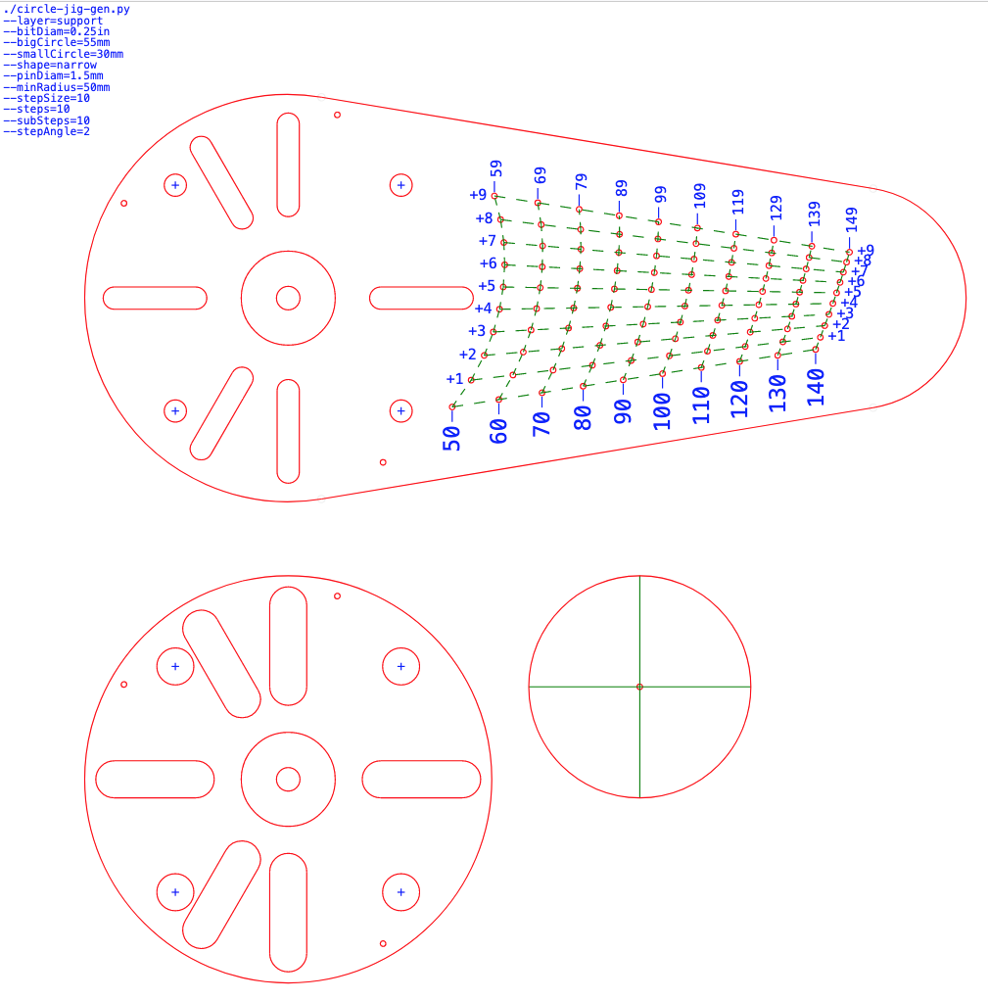
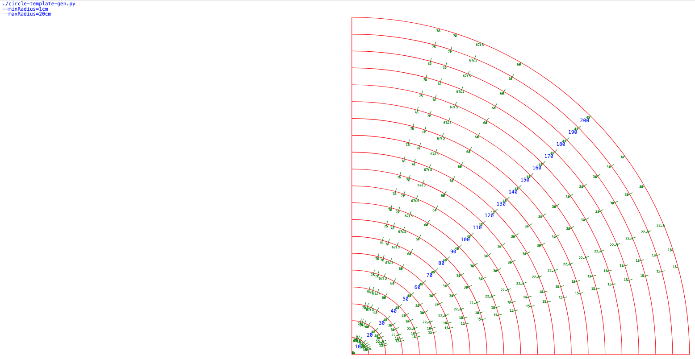

# circle-jig-gen

A simple generator for circle-cutting router jigs.

See examples below for usage.

## Examples

Two-layer jig, including a "support" piece, which can be glued to the wood to avoid making holes. 
With screw rails, metric, "narrow" mode, for 1/4in bit.

Small imperial jig in the "line" mode, for 1/4in bit

Small imperial jig in the "narrow" mode, for 1/4in bit

Larger metric jig in the "rectangle" mode, for 1/2in bit

Set of templates for flush-trim routing

